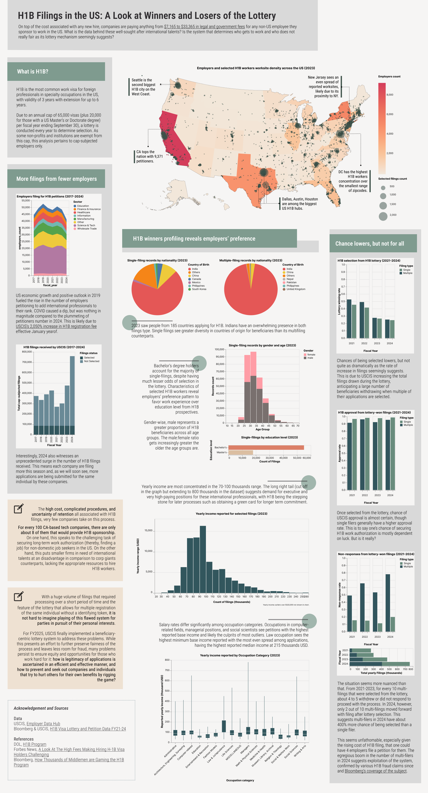

# H1B Data Project
**H1B Filings in the US: A look at Winners and Losers of the Lottery**

CAPP 30239 Static Visualization Capstone Project - Minh Nghiem

## Project Description
H1B visa--oftentimes referred to as the hard-earned ticket to working opportunities in the US--has been the goal for many international job-seeking prospectives, be it a student who just graduated, or a foreign national looking to land a job from overseas. Because there is a cap of 85,000 visas in place, a lot of money is spent into selection every year, and while the process is not unclear, the paradigm of execution and selection by means of a lottery is far from straightforward.

Using USCIS-sourced, Bloomberg-obtained filings data at the level of details never before seen, this project explores the profile of selected H1Bs and dives into the trend and outcome of the lottery in the last 4 years (FY21-24). In addition to serving as the factsheet for curious Americans and H1B hopefuls, the project aims to call attention to the inequity that permeates the system, thus providing the basis for all to engage in discourse for process reform.

*Note: the dataset and this project deal with cap-subjected employers only, as non-profits and educational institutions meeting certain requirements are exempt from this visa cap and lottery selection taking on H1B workers.*

## Final work Preview

## How to Generate the Graphs

All the graphs produced for this infographic can be replicated by running the code in `./src/graphs.ipynb` once you get all the data and run `uv sync` in the terminal to install all necessary packages. 

Due to Github's limit on uploads, in additional to the data files that are now in the data/ directory, please find and download 5 .csv files of [USCIS data that was obtained by Bloomberg](https://github.com/BloombergGraphics/2024-h1b-immigration-data).

These files should be put in the `./data/` directory. For the code to run properly, please rename them as follows:

- `TRK_13139_FY2021.csv` --> `bloomberg_h1b_records_2021.csv`

- `TRK_13139_FY2022.csv` --> `bloomberg_h1b_records_2022.csv`

- `TRK_13139_FY2023.csv` --> `bloomberg_h1b_records_2023.csv`

- `TRK_13139_FY2024_single_reg.csv` --> `bloomberg_h1b_records_2024_singl.csv`

- `TRK_13139_FY2024_multi_reg.csv` --> `bloomberg_h1b_records_2024_multi.csv`

## Acknowledgement and Sources
**Data**

USCIS, [Employer Data Hub](https://www.uscis.gov/tools/reports-and-studies/h-1b-employer-data-hub)

Bloomberg & USCIS, [H1B Visa Lottery and Petition Data FY21-24](https://github.com/BloombergGraphics/2024-h1b-immigration-data)

**References**

DOL, [H1B Program](https://www.dol.gov/agencies/whd/immigration/h1b)

Forbes News, [A Look At The High Fees Making Hiring H-1B Visa Holders Challenging](https://www.forbes.com/sites/stuartanderson/2024/02/22/a-look-at-the-high-fees-making-hiring-h-1b-visa-holders-challenging/)

Bloomberg, [How Thousands of Middlemen are Gaming the H1B Program](https://www.bloomberg.com/graphics/2024-staffing-firms-game-h1b-visa-lottery-system/)